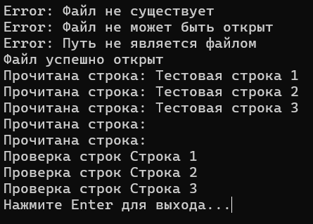

# file_library

Библиотека для удобной работы с файлами на C++ в режиме чтения и записи (аналог `r+` в Python).

---

## Результат работы демонстрационной программы



Вывод в консоль и изменения в файле examples/example_write.txt - добавление 6 новых строк.

## Описание

Класс `File` предоставляет интерфейс для открытия файла одновременно для чтения и записи.  
Особенности:
- Чтение построчно с запоминанием позиции.
- Запись всегда происходит в конец файла.
- Поддержка возврата указателя чтения в начало.
- Проверка существования файла и типа пути.
- Выбрасывает информативные исключения при ошибках.

---

## Структура проекта

```
/
├── CMakeLists.txt # Файл сборки CMake
├── main.cpp # Демонстрационная программа
├── lib/
│ ├── filelib.cpp # Реализация класса File
│ ├── exceptions.cpp # Реализация исключений
│ └── filelib.h # Заголовочный файл с объявлениями
├── examples/ # Примеры файлов для тестирования
│ ├── example_read.txt
│ ├── example_write.txt
│ └── locked.txt
├── file_library.vcxproj* # Проекты для Visual Studio (необязательно)
├── file_library.vcxproj.filters # (необязательно)
├── file_library.sln # Файл решения
└── .gitignore # Файл с исключением файлов
```

---

## Сборка с помощью CMake

1. В корне проекта создайте папку сборки и перейдите в неё:

```bash
mkdir build
cd build
```
2. Запустите генерацию сборочных файлов:
```bash
cmake ..
```
3. Соберите проект:
```bash
cmake --build .
```

> Собранынй файл необходимо поместить рядом с main.cpp.

---

## Использование класса File
### Конструктор
```cpp
File(const std::string& path);
```
- Открывает файл path для чтения и записи.
- Если файла нет — выбрасывается исключение FileNotFoundError.
- Если путь существует, но это не файл — выбрасывается NotAFileError.
- Если файл нельзя открыть — выбрасывается FileCanNotBeOpenError.
---
### Деструктор
```cpp
File::~File() {
	if (stream.is_open()) {
		stream.close();
	}
}
```

Необходим для сохранения RAII

---
### Методы
```cpp
std::string readLine();
```
- Считывает одну строку из файла.
- При достижении конца возвращает пустую строку "".
- Если произошла ошибка чтения (кроме EOF) — выбрасывает ReadingError.
```cpp
void writeLine(const std::string& line);
```
- Записывает строку в конец файла с переводом строки.
- При ошибке записи выбрасывает WritingError.
```cpp
void goToBegin();
```
- Возвращает указатель чтения в начало файла.
- Запись всегда идёт в конец, сдвиг записи не происходит.
---
## Исключения

| Исключение              | Описание                               | Когда выбрасывается                             |
| ----------------------- | -------------------------------------- | ----------------------------------------------- |
| `FileNotFoundError`     | Файл не существует                     | Если файла нет по указанному пути               |
| `NotAFileError`         | Путь существует, но это не файл        | Если путь ведёт к директории или другому типу   |
| `FileCanNotBeOpenError` | Файл существует, но не удалось открыть | Ошибка открытия файла (например, права доступа) |
| `ReadingError`          | Ошибка чтения строки из файла          | При сбое чтения (кроме конца файла)             |
| `WritingError`          | Ошибка записи строки в файл            | При сбое записи (например, диск полный)         |

